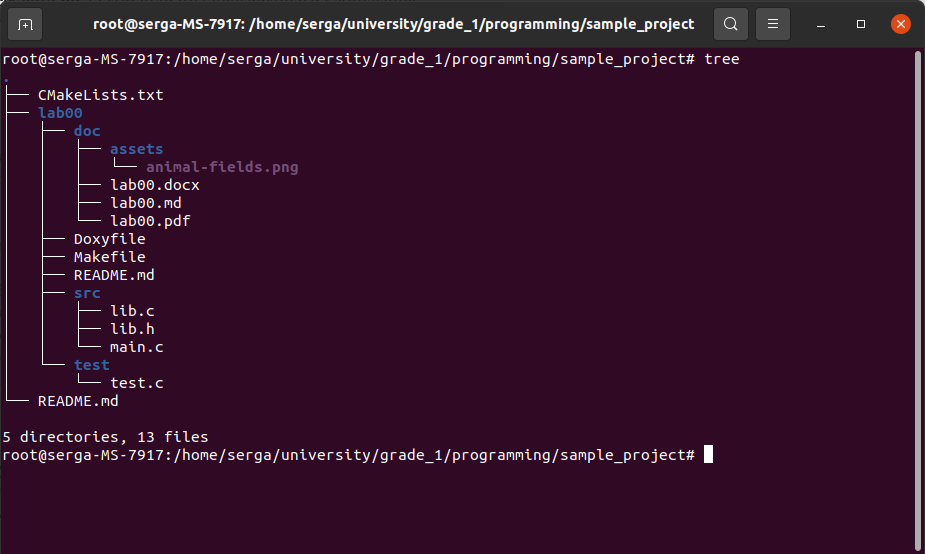
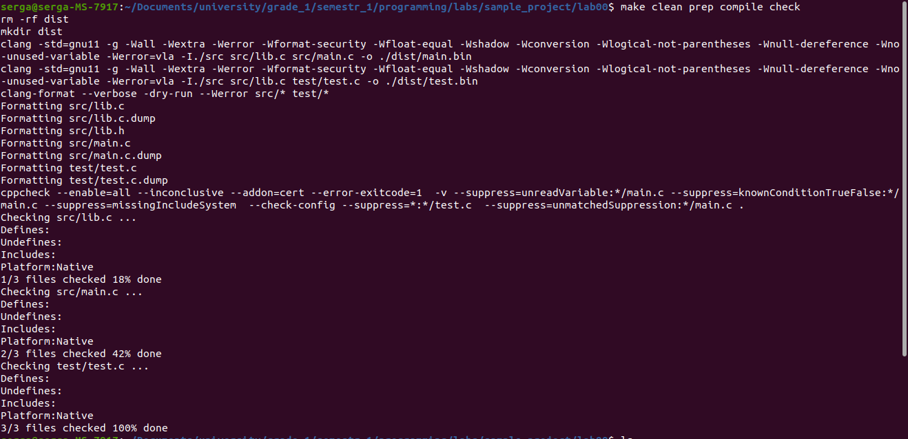
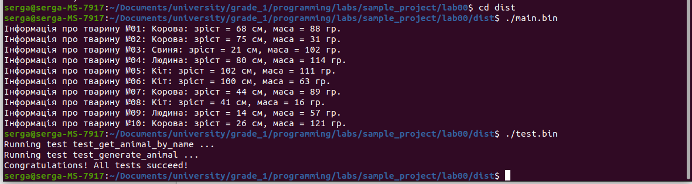
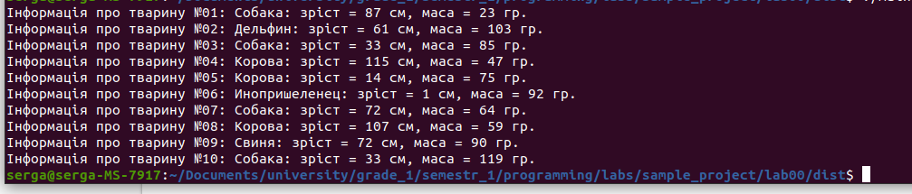
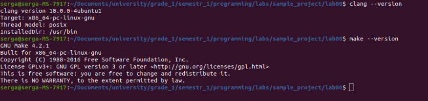
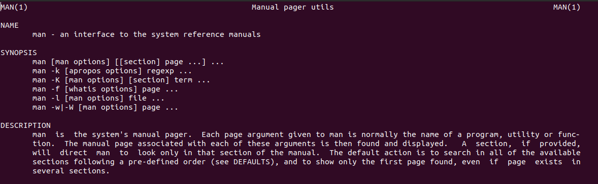

# Лабораторна робота №1. Вступ до програмування. Освоєння командної строки Linux
Мета:  розробити лінійну програм

## 1 Вимоги

### 1.1 Розробник
Інформація про розробника: 
- Соболенко С. С.;
- КІТ-121б;

### 1.2 Загальне завдання
1) 

### 1.3 Задача
1. Завантажую та ставлю Ubuntu. 
2. Інсталюю мінімально-необхідні пакети (програмні додатки): git, gcc, clang, clang-format, clang-tidy, tree, make, cppcheck. 
3. За допомогою системи контролю git та команди git clone виконую клонування репозиторія за наданим посиланням.

## 2. ОПИС ПРОГРАМИ

### 2.1 Функціональне призначення
Освоїти базові принципи роботи з Linux, Git та GitHub

### 2.2 Опис логічної структури
За допомогою команди tree знаходимо положення Makefile

Рисунок 2.1 - Виконання команди tree у терміналі

Переходимо до каталогу та виконуємо компіляцію проекту за допомогою make

Рисунок 2.2 - Збірка проекту

Переходимо до створеної директорії та виконуємо отримані бінарні файли 

Рисунок 2.3 - Виведення результату виконання бінарних файлів

За допомогою nano редагуємо дані програми та до Makefile додаймо all

Рисунок 2.4 - Виконання бінарних файлів після зміни даних програми та Makefile

Прапорцем --version визначаємо версію clang та make

Рис.2.5 - Версія make, clang 

Визначимо значення утиліти man

Рис.6 Загальний опис утиліти man

### 2.3 Важиливі фрагменти програми

##  3 ВАРІАНТИ ВИКОРИСТАННЯ

##  ВИСНОВКИ
Було встановлено ОС Ubuntu  та було виконано ознайомлення с 
системою git, виконана робота з проектом через термінал та розуміння алгоритму роботи команди make.
