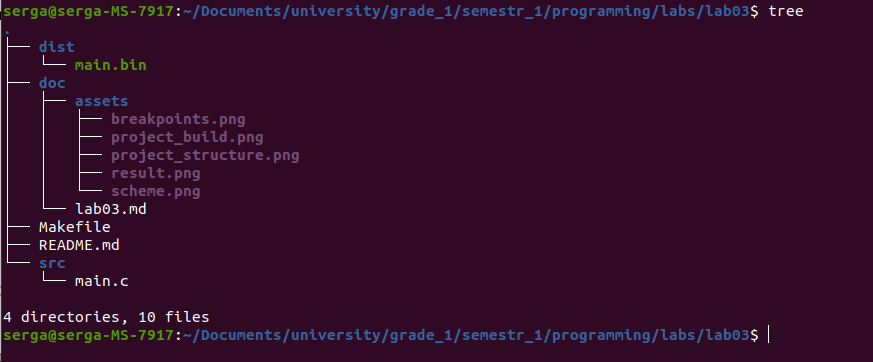

# Лабораторна робота №3. Розробка лінійних програм
Мета:  розробити лінійну програм

## 1 Вимоги

### 1.1 Розробник
Інформація про розробника: 
- Соболенко С. С.;
- КІТ-121б;

### 1.2 Загальне завдання
1)  Розробити лінійну програму рішення прикладної задачі мовою С.
2) Продемонструвати роботу в режимі відлагодження

### 1.3 Задача
1. Створити дві змінні, що будуть визначати нижню та верхню границю діапозону.
2. Використовуючи формулу суми арифеметичної прогресії, визначити суму чисел у даному діапозоні.

## 2. ОПИС ПРОГРАМИ

### 2.1 Функціональне призначення
Програма призначена для знаходження рішення лінійного алгоритму за допомогою арифметичних операцій. Результат зберігається у відповідній змінній. Демонстрація знайденого результату передбачає покрокове виконання програми в режимі відлагодження.

### 2.2 Опис логічної структури
За допомогою формули суми арифметичної прогресії знаходимо результуючу суму.

Алгоритм програми наведено на рис.2.1.


Рисунок 2.1 - Схема алгоритму програми

Структура проекту наведена на рис.2.2.



Рисунок 2.2 - Структура проекту

### 2.3 Важиливі фрагменти програми

Обʼявлення та встановлення початкових значень змінних
```c
	    /* Задаю значения діапазона */
	    int minNumber = 10;
	    int maxNumber = 15;
	
```

Підрахунок суми чисел у заданому діапозоні

```c
	    /* Формула суми арифметичної прогресії: S = (A1 + An) * n / 2. */
	    int sum = (minNumber + maxNumber) * (maxNumber - minNumber + 1) / 2;
```

##  3 ВАРІАНТИ ВИКОРИСТАННЯ
Для демонстрації результатів використовується покрокове виконання програми.

0) Збірка програми (див. рис.3.0)


Рисунок 3.0 - Виконання Makefile

1) Установка точок зупину (див. рис.3.1)


Рисунок 3.1 - Точки зупину, що встановлені

2) Покрокове виконання та підрахунок суми(див. рис.3.2).


Рисунок 3.2 - Результат у змінній "sum" 

##  ВИСНОВКИ
Розроблено лінійну програму рішення прикладної задачі мовою С. Засоби відлагодження та покрокове виконання програми дозволяють продемонструвати коректність реалізованого алгоритму.
