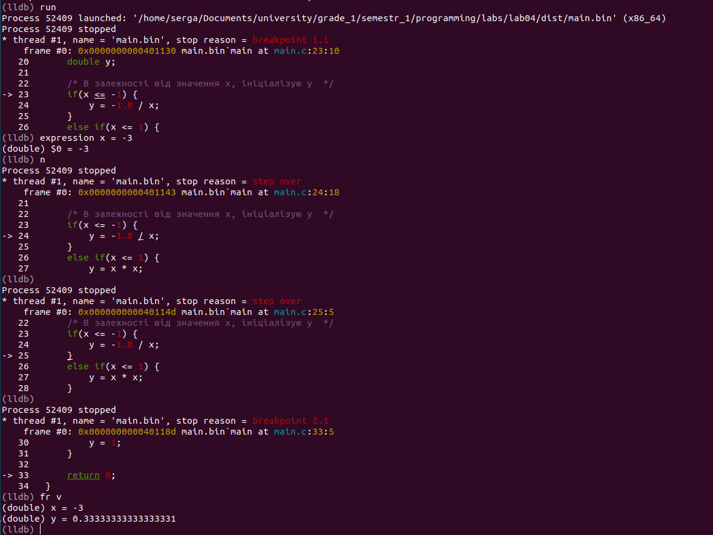

# Лабораторна робота №4. Розробка програм, що розгалужуються
Мета:  розробити програму, що розгалужується

## 1 Вимоги

### 1.1 Розробник
Інформація про розробника: 
- Соболенко С. С.;
- КІТ-121б;

### 1.2 Загальне завдання
1) Розробити програму, що розгалужується для рішення прикладної задачі мовою С.
2) Продемонструвати роботу в режимі відлагодження

### 1.3 Задача
1. Створити змінну х, що буде визначати значення функції
2. Спираючись на графік, визначити за допомогую умовної конструкції значення функції у

## 2. ОПИС ПРОГРАМИ

### 2.1 Функціональне призначення
Програма призначена для знаходження рішення розгалуженого алгоритму за допомогою арифметичних операцій та умовної конструкції. Результат зберігається у відповідній змінній. Демонстрація знайденого результату передбачає покрокове виконання програми в режимі відлагодження.

### 2.2 Опис логічної структури
За допомогою умовних конструкцій "if", "else if" та "else" визначаю значення функції у.

Алгоритм програми наведено на рис.2.1.


Рисунок 2.1 - Схема алгоритму програми

Структура проекту наведена на рис.2.2.


Рисунок 2.2 - Структура проекту

### 2.3 Важиливі фрагменти програми

Обʼявлення та встановлення початкових значень змінних
```c
	    /* Задаю значения змінної х та оголошую у*/
	    double x = 10.0;
	    double y;
	
```

Визначення значення функції y

```c
	    /* В залежності від значення х, ініціалізую у  */
	    if(x <= -1) { 
		y = -1.0 / x;
	    }
	    else if(x <= 1) {
		y = x * x;
	    }
	    else {
		y = 1;
	    }
```

##  3 ВАРІАНТИ ВИКОРИСТАННЯ
Для демонстрації результатів використовується покрокове виконання програми.

0) Збірка програми (див. рис.3.0)


Рисунок 3.0 - Виконання Makefile

1) Установка точок зупину (див. рис.3.1)


Рисунок 3.1 - Точки зупину, що встановлені

2) Покрокове виконання та підрахунок суми(див. рис.3.2).



Рисунок 3.2 - Результат у змінній "y" 

##  ВИСНОВКИ
Розроблено програму, що розгалужується для рішення прикладної задачі мовою С. Засоби відлагодження та покрокове виконання програми дозволяють продемонструвати коректність реалізованого алгоритму.
