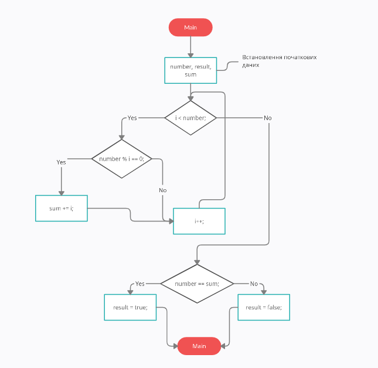
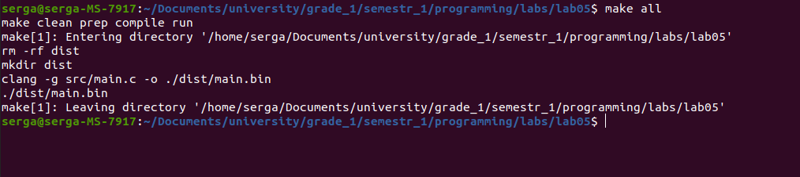

# Лабораторна робота №5. Циклічні конструкції
Мета:  розробити програму з циклічною конструкцією

## 1 Вимоги

### 1.1 Розробник
Інформація про розробника: 
- Соболенко С. С.;
- КІТ-121б;

### 1.2 Загальне завдання
1) Розробити програму з циклічною кострукцією для рішення прикладної задачі мовою С.
2) Продемонструвати роботу в режимі відлагодження

### 1.3 Задача
1. Створити змінну n, що і буде даним числом
2. Проходячись циклом по всім числам до n, визначаю які з них є його дільниками та сумую їх якщо так

## 2. ОПИС ПРОГРАМИ

### 2.1 Функціональне призначення
Програма призначена для знаходження рішення алгоритму з циклом за допомогою арифметичних операцій, циклічної конструкції та умовної конструкції. Результат зберігається у відповідній змінній. Демонстрація знайденого результату передбачає покрокове виконання програми в режимі відлагодження.

### 2.2 Опис логічної структури
За допомогою циклу "for" проходжусь по всім числам до n та фільтруючи їх за допомогою "if", якщо дане число ділиться без остачи, сумую їх. Після чого порівнюю суму з даним числом та визначаю результат.

Алгоритм програми наведено на рис.2.1.



Рисунок 2.1 - Схема алгоритму програми

Структура проекту наведена на рис.2.2.


Рисунок 2.2 - Структура проекту

### 2.3 Важиливі фрагменти програми

Обʼявлення та встановлення початкових значень змінних

```c
	    /* Задаю значения даного числа */
	    int number = 6;
	    /* Оголошую змінну, що буду означати результат*/
	    bool result;
	    /* Змінна для суми усіх дільників числа*/
	    int sum = 0;
	
```

Визначення суми дільників числа

```c
	    /* Проходжу циклом по всім числам від 1 до даного та визначаю його дільники */    
	    for(int i = 1; i < number; i++){
		
		/* Умова, що визначає чи є число дільником */
		if(number % i == 0){
		    sum += i;
		}
	    }
```

Визначення результату

```c
	    /* В залежності від отриманої суми визначаю результат */
	    if(sum == number){
		result = true;
	    }
	    else{
		result = false;
	    }
```

##  3 ВАРІАНТИ ВИКОРИСТАННЯ
Для демонстрації результатів використовується покрокове виконання програми.

0) Збірка програми (див. рис.3.0)



Рисунок 3.0 - Виконання Makefile

1) Установка точок зупину (див. рис.3.1)


Рисунок 3.1 - Точки зупину, що встановлені

2) Покрокове виконання та підрахунок суми(див. рис.3.2).


Рисунок 3.2 - Результат у змінній "result" 

##  ВИСНОВКИ
Розроблено програму з циклом для рішення прикладної задачі мовою С. На мою думку алгоритм не є ідеальним рішенням с точки зору продуктивністі, адже дільники числа закінчуються значно раніше ніж саме число. Але засоби відлагодження та покрокове виконання програми дозволяють продемонструвати коректність реалізованого алгоритму.
