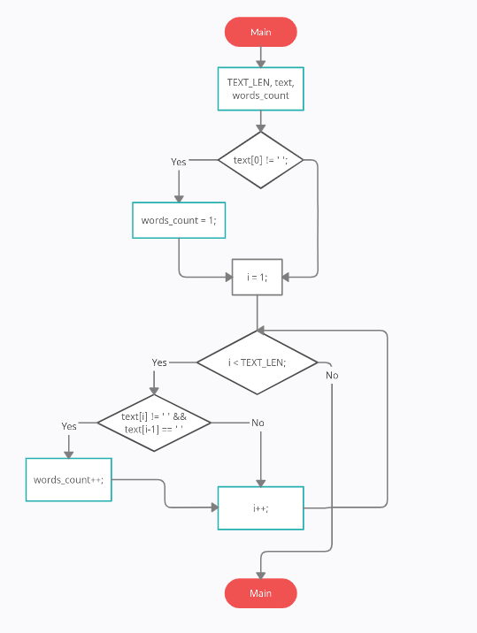
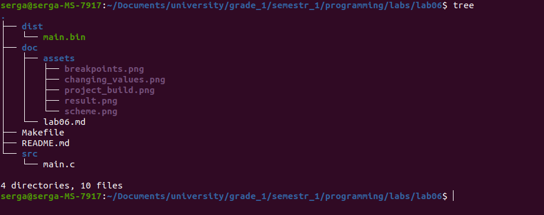
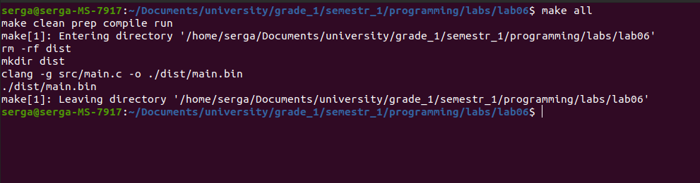
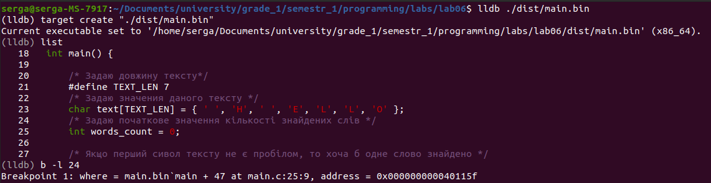
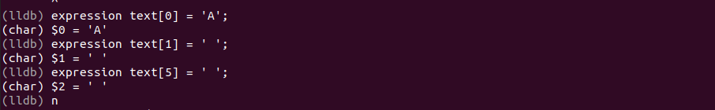
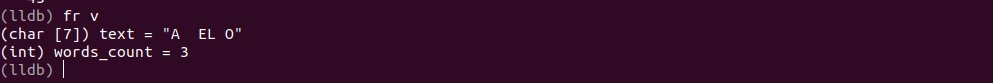

# Лабораторна робота №6. Масиви
Мета:  розробити програму з масивом
## 1 Вимоги

### 1.1 Розробник
Інформація про розробника: 
- Соболенко С. С.;
- КІТ-121б;

### 1.2 Загальне завдання
1) Розробити програму з масивом для рішення прикладної задачі мовою С.
2) Продемонструвати роботу в режимі відлагодження

### 1.3 Задача
1. Створити змінну text, що буде вихідним текстом
2. Створити змінну words_count, що буде означати кількість слів у тексті
2. Проходячись циклом по всім символам визначаю за шаблоном кількість слів

## 2. ОПИС ПРОГРАМИ

### 2.1 Функціональне призначення
Програма призначена для знаходження рішення алгоритму з масивом за допомогою арифметичних операцій, циклічної конструкції та умовної конструкції. Результат зберігається у відповідній змінній. Демонстрація знайденого результату передбачає покрокове виконання програми в режимі відлагодження.

### 2.2 Опис логічної структури
За допомогою циклу "for" проходжусь по всім символам строки, починаючи з другого, та якщо виконується умова: попередній символ є пробілом, а даний ні, то маємо нове слово, тож збільшуємо кількість знайдених слів.

Алгоритм програми наведено на рис.2.1.



Рисунок 2.1 - Схема алгоритму програми

Структура проекту наведена на рис.2.2.



Рисунок 2.2 - Структура проекту

### 2.3 Важиливі фрагменти програми

Обʼявлення та встановлення початкових значень змінних

```c
	    /* Задаю довжину тексту*/
	    #define TEXT_LEN 7
	    /* Задаю значения даного тексту */
	    char text[TEXT_LEN] = { ' ', 'H', ' ', 'E', 'L', 'L', 'O' };
	    /* Задаю початкове значення кількості знайдених слів */
	    int words_count = 0;
```

Визначення кількості слів

```c
	    /* Якщо перший сивол тексту не є пробілом, то хоча б одне слово знайдено */      
	    if(text[0] != ' '){
		words_count = 1;
	    }
	    
	    /* Проходжусь по кожному символу у тексті, починаючи з другого, та визначаю кількість слів */
	    for(int i = 1; i < TEXT_LEN; i++){
		
		/* Шаблон виявлення слова: якщо даний символ не є пробілом, а попередній є, то маємо нове слово */
		if(text[i] != ' ' && text[i-1] == ' '){
		    words_count++;
		}
	    }
```


##  3 ВАРІАНТИ ВИКОРИСТАННЯ
Для демонстрації результатів використовується покрокове виконання програми.

0) Збірка програми (див. рис.3.0)



Рисунок 3.0 - Виконання Makefile

1) Установка точок зупину (див. рис.3.1)



Рисунок 3.1 - Точки зупину, що встановлені

2) Покрокове виконання (див. рис.3.2).





Рисунок 3.2 - Результат у змінній "words_count" 

##  ВИСНОВКИ
Розроблено програму з масивом для рішення прикладної задачі мовою С. Засоби відлагодження та покрокове виконання програми дозволяють продемонструвати коректність реалізованого алгоритму.
