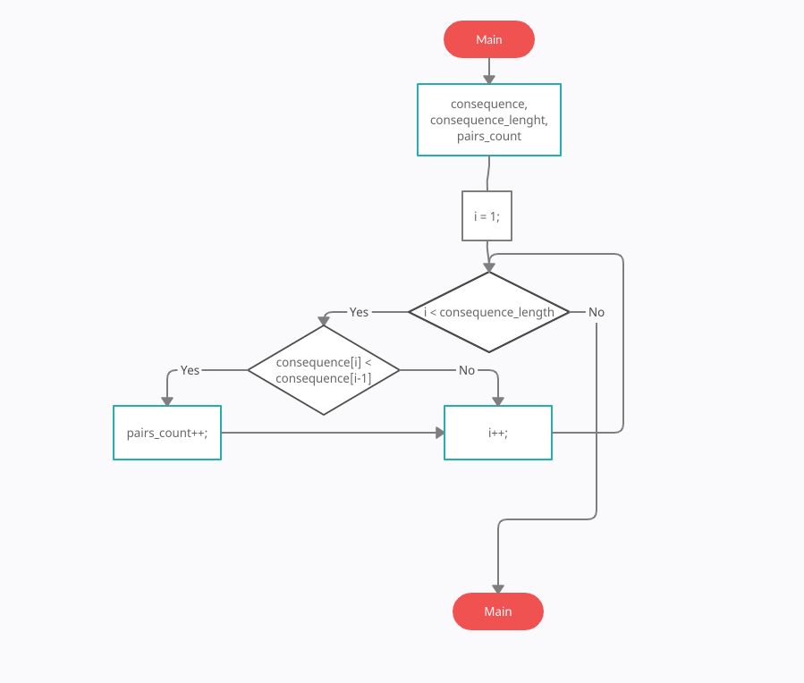
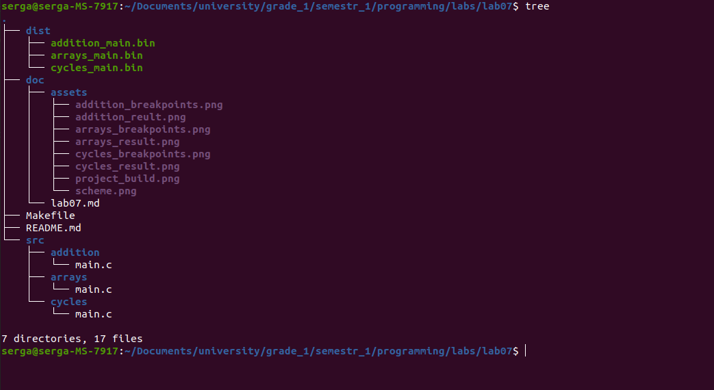
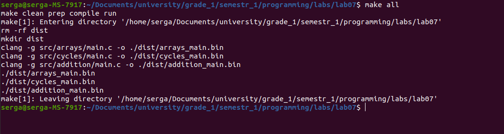
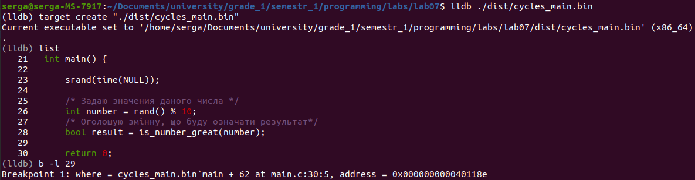
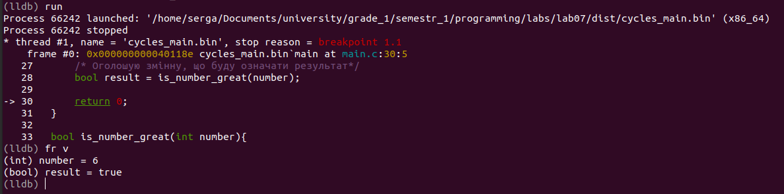
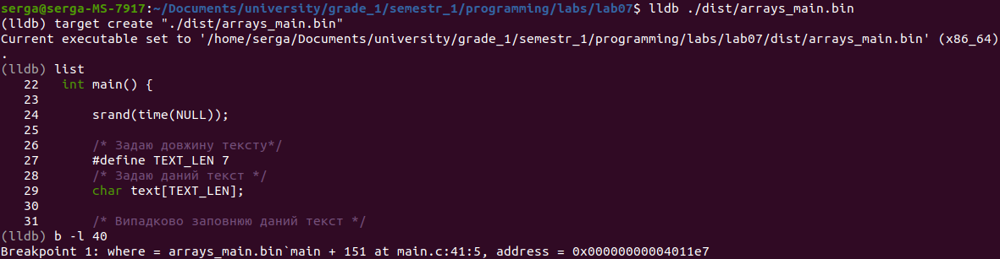
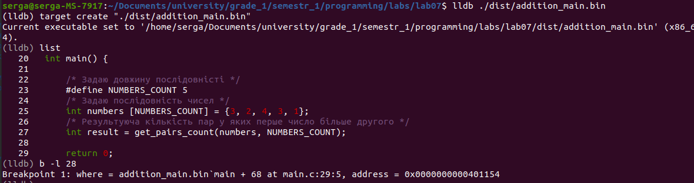
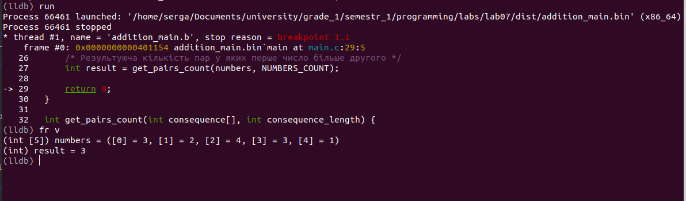

# Лабораторна робота №8 Вступ до документації коду
Мета:  Переробити програми, розроблені під час виконання лабораторних робіт на теми
"Массивы" і "Цикли" таким чином, щоб код не мав повторень, використовуючи функції та написати додаткову програму
## 1 Вимоги

### 1.1 Розробник
Інформація про розробника: 
- Соболенко С. С.;
- КІТ-121б;

### 1.2 Загальне завдання
1) Переробити програми, розроблені під час виконання лабораторних робіт на теми
"Массивы" і "Цикли" таким чином, щоб код не мав повторень, використовуючи функції
2) Написати додаткову програму з використанням функцій
3) Продемонструвати роботу в режимі відлагодження

### 1.3 Задача
1. Переробити програму с lab05 використовуючи функції
2. Переробити програму с lab06 використовуючи функції
3. Визвати функції з використанням згенерованих параметрів
4. Написати програму  що визначає, скільки серед заданої послідовності чисел таких пар, у
котрих перше число менше наступного, використовуючи функцію

## 2. ОПИС ПРОГРАМИ

### 2.1 Функціональне призначення
1. Призначення перших двох програм не змінилось
2. Призначення нової програми: знаходження рішення алгоритму з масивом за допомогою арифметичних операцій, циклічної конструкції, умовної конструкції та функції. Результат зберігається у відповідній змінній. Демонстрація знайденого результату передбачає покрокове виконання програми в режимі відлагодження.

### 2.2 Опис логічної структури
1) Логіка перших двох програм не змінилась, лише програми була перероблені з використанням функцій та додано визов ціх функцій зі згенерованими значеннями

2) Реалізовую функцію, у якій циклом проходжу по всім членам послідовності, починаючи з другого, та завдяки умові у циклі з'ясовую чи є i-ий елемент меншим за (i-1)-ий, якщо так, то збільшую кількість знайдених пар

Алгоритм програми наведено на рис.2.1.



Рисунок 2.1 - Схема алгоритму програми

Структура проекту наведена на рис.2.2.



Рисунок 2.2 - Структура проекту

### 2.3 Важиливі фрагменти програми

Обʼявлення та встановлення початкових значень змінних

```c
	    /* Задаю довжину послідовністі */
	    #define NUMBERS_COUNT 5
	    /* Задаю послідовність чисел */
	    int numbers [NUMBERS_COUNT] = {3, 2, 4, 3, 1};
	    /* Результуюча кількість пар у яких перше число більше другого */
	    int result = get_pairs_count(numbers, NUMBERS_COUNT);
```

Підрахунок кількості пар які задовольнять вказаній умові 

```c
	int get_pairs_count(int consequence[], int consequence_length) {

	    /* Задаю лічильник кількості знайдених пар */
	    int pairs_count = 0;

	    /* Проходжусь по всім числам послідовності починаючи з другого для визначення кількості пар */
	    for(int i = 1; i < consequence_length; i++) {
	    	
	    	/* Якщо i-те число менше ніж (i-1)-ше число, то збільшуємо кількість пар */
		if(consequence[i] < consequence[i-1]) {
		    pairs_count++;
		}
	    }
	    
	    return pairs_count;
}
```


##  3 ВАРІАНТИ ВИКОРИСТАННЯ
Для демонстрації результатів використовується покрокове виконання програми.

0) Збірка програми (див. рис.3.0)



Рисунок 3.0 - Виконання Makefile

1) Установка точок зупину першої програми(див. рис.3.1.1)



Рисунок 3.1.1 - Точки зупину, що встановлені

2) Покрокове виконання першої програми (див. рис.3.1.2).



Рисунок 3.1.2 - Результат у змінній "result"


3) Установка точок зупину другої програми(див. рис.3.2.1)



Рисунок 3.2.1 - Точки зупину, що встановлені

4) Покрокове виконання другої програми (див. рис.3.2.2).


Рисунок 3.2.2 - Результат у змінній "result"


5) Установка точок зупину нової програми(див. рис.3.3.1)



Рисунок 3.3.1 - Точки зупину, що встановлені

6) Покрокове виконання нової програми (див. рис.3.3.2).



Рисунок 3.3.2 - Результат у змінній "result" 

##  ВИСНОВКИ
Перероблено код з перших двох програм з використанням функцій, також до коду додано возов ціх функцій зі псевдоранодмно згенерованими параметрами. Написано додаткову програму з використанням функцій. Засоби відлагодження та покрокове виконання програми дозволяють продемонструвати коректність реалізованого алгоритму. 
