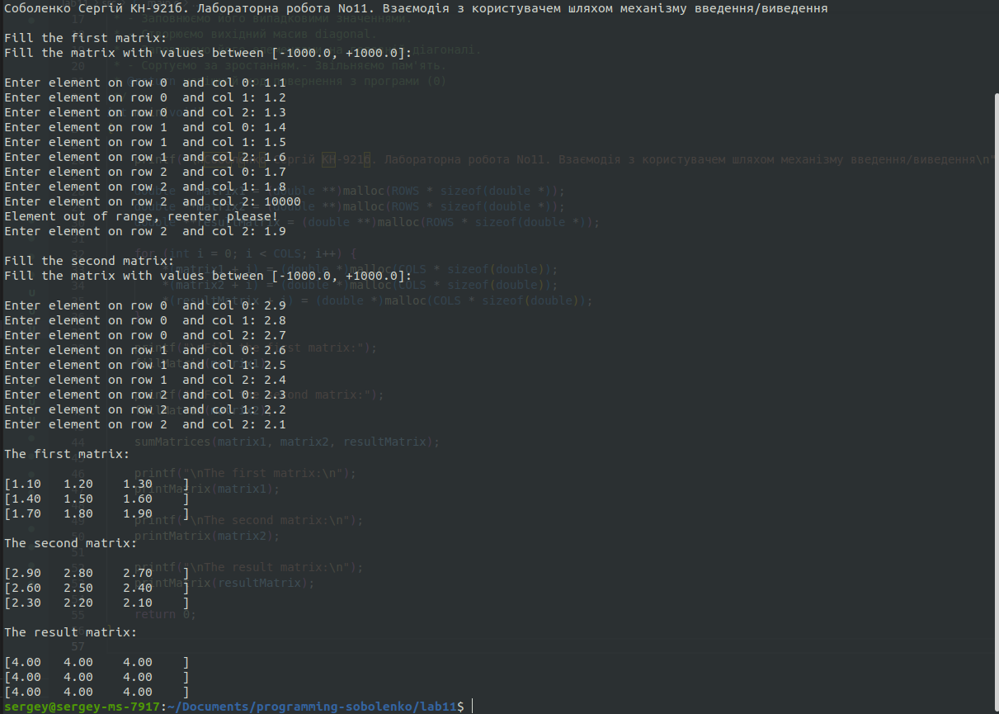

# Лабораторна робота No11. Взаємодія з користувачем шляхом механізму введення/виведення

## 1 Вимоги

### 1.1 Розробник

* Соболенко Cергій Сергійович;
* студент групи КН-921б;
* 05-jul-2021.

### 1.3 Індивідуальне завдання

5. Визначити суму двох матриць.

## 2 Опис програми

### 2.1 Функціональне призначення

Програма призначена для зчитування двох матриць з консолі, їх сумування за математичними правилами та виводу результату до консолі.

### 2.2 Опис логічної структури

#### Функція заповнення матриці

```c
		fillMatrix(double **matrix);
```

*Призначення*: Заповнення необхідними елементами результуючий масив.

*Опис роботи*: 
  - У вкладеному циклі запрошувати елемент у консолі та перевіряти його на валідність
  - Перепрошувати, якщо не валідний(поза діапозоном)

#### Функція сумування матриць

```c
		sumMatrices(double **matrix1, double **matrix2, double **resultMatrix);
```

*Призначення*: Поелементо скласти матриці до результуючої

*Опис роботи*:
  - У вкладеному циклі поелементно сумувати дві матриці та записувати результат до resultMatrix

#### Функція виводу матриці

```c
		sumMatrices(double **matrix1, double **matrix2, double **resultMatrix);
```

*Призначення*: вивід матриці до консолі

*Опис роботи*:
  - У вкладеному циклі поелементно виводити матрицю до консолі 

#### Основна функція

```c
		int main(void)
```

*Призначення*: демонстрація виконаної роботи.

 *Опис роботи*: 
    - Створюємо першу, другу та результуючу матрицію
    - Заповнюємо першу та другу матриці
    - Розраховуємо результуючу матрицю
    - Виводимо вхідні та вихідну матриці

#### Структура проекту

```
        lab11
        ├── doc
        │   └── lab11.md
        ├── Doxyfile
        ├── Makefile
        ├── README.md
        ├── src
        │   ├── lib.c
        │   ├── lib.h
        │   └── main.c
        └── test
            └── test.c
```

### 2.3 Важливі фрагменти програми

#### Початкові дані

```c
        /**
         * Кількість рядків матриці
         */
        #define ROWS 3

        /**
         * Кількість стовпців матриці 
         */
        #define COLS 3
```

#### Заповнення матриці з консолі з валідацією

```c
        void fillMatrix(double **matrix) {
            printf("\nFill the matrix with values between [-1000.0, +1000.0]: \n\n");

            for(int i = 0; i < ROWS; i++) {
                for(int j = 0; j < COLS; j++) {
                    double element = 1001; // if user will skip, accidentally

                    label:
                        printf("Enter element on row %d  and col %d: ", i, j);
                                        
                        scanf("%lf", &element);

                        if (element < -1000.0 || element > 1000.0) {
                            printf("Element out of range, reenter please!\n");
                            goto label;
                        }
                        *(*(matrix + i) + j) = element;
                }
            }
        }
```

#### Вивід матриці до консолі

```c
        void printMatrix(double **matrix) {
            printf("\n"); 
            for (int i = 0; i < ROWS; i++) {
                printf("[");
                
                for (int j = 0; j < COLS; j++) {
                    printf("%.2f\t", *(*(matrix + i) + j));
                }

                printf("]\n");
            }
        }
```

## Варіанти використання

**Варіант використання 1**: послідовність дій для запуску програми у консолі:

- запустити програму;
- ввести елементи двох матриць;
- подивитись результати виконання програми;



**Варіант використання 2**: запустити тести с з покриттям

- Результати покриття тестами не є дуже гарними, через те, що у lib.c
функціі логіки розташовані з функціями вводу/виводу, які не подлягають
тестуванню(у цьому прикладі). Варіанти покращення покриття: перенести функції бізнес логіки до іншого файлу та тестувати його або додати тестування функцій вводу/виводу шляхом перенаправлення потоків.
```
        Filename                                                         Regions    Missed Regions     Cover   Functions  Missed Functions  Executed       Lines      Missed Lines     Cover
        ------------------------------------------------------------------------------------------------------------------------------------------------------------------------------------------------------------------------------
        /home/sergey/Documents/programming-sobolenko/lab11/src/lib.c          33                24    27.27%           3                 2    33.33%          39                32    17.95%
        ------------------------------------------------------------------------------------------------------------------------------------------------------------------------------------------------------------------------------
        TOTAL                                                                 33                24    27.27%           3                 2    33.33%          39                32    17.95%
        llvm-cov show dist/test.bin -instr-profile=dist/test.profdata src/*.c --format html > dist/coverage.html
```

**Витоків пам'яті немає**
```
        ==66192== Memcheck, a memory error detector
        ==66192== Copyright (C) 2002-2017, and GNU GPL'd, by Julian Seward et al.
        ==66192== Using Valgrind-3.15.0 and LibVEX; rerun with -h for copyright info
        ==66192== Command: test
        ==66192== 
        ==66192== 
        ==66192== HEAP SUMMARY:
        ==66192==     in use at exit: 0 bytes in 0 blocks
        ==66192==   total heap usage: 30 allocs, 30 frees, 4,065 bytes allocated
        ==66192== 
        ==66192== All heap blocks were freed -- no leaks are possible
        ==66192== 
        ==66192== For lists of detected and suppressed errors, rerun with: -s
        ==66192== ERROR SUMMARY: 0 errors from 0 contexts (suppressed: 0 from 0)
```

## Висновки

При виконанні даної лабораторної роботи було набуто практичного досвіду роботи з функціями вводу та виводу.